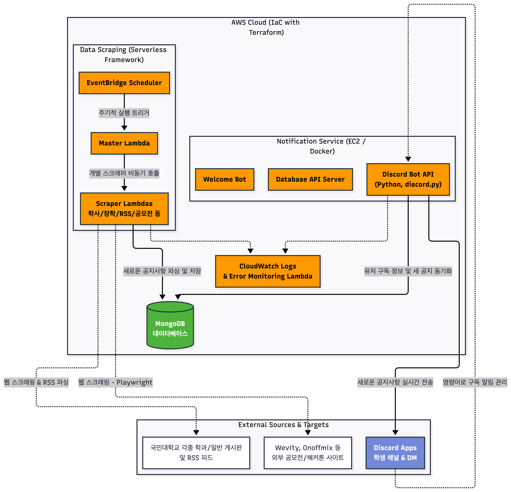

# Kookmin Feed (국민대학교 피드 시스템)

국민대학교의 다양한 학과/단과대학 공지사항 및 교내·외 공모전/해커톤 정보를 실시간으로 확인하고, 사용자가 구독한 정보만 선별하여 디스코드(Discord)로 알림을 보내주는 통합 알림 시스템입니다.

## 🚀 프로젝트 개요

Kookmin Feed는 여러 소스에 흩어져 있는 학교 관련 정보들을 한 곳에 모아, 학생들이 놓치기 쉬운 주요 공지 및 스펙업 기회를 빠르고 편리하게 제공하기 위해 개발되었습니다. 

시스템은 크게 **정보를 수집하는 크롤링 서버(AWS Lambda)**와 **사용자에게 정보를 전달하는 디스코드 봇(AWS EC2)**으로 구성되어 있으며, **Terraform**을 통한 인프라 자동화(IaC)를 기반으로 클라우드 환경에서 관리 및 운영됩니다.

---

## 🏗️ 시스템 아키텍처

---

## 📂 주요 리포지토리 구성

본 시스템은 확장성과 유지보수성을 위해 기능별로 저장소를 분리하여 구성되어 있으며, 각 프로젝트의 역할은 다음과 같습니다.

### 1. `kookmin-feed-crawling-server` (크롤링 서버)
- **역할**: 국민대 각 학과/학부 공지사항, 도서관 모듈, 교외 공모전/해커톤(Wevity, Onoffmix 등) 데이터를 주기적으로 긁어와 중복 여부를 판별하여 최신 정보를 Database에 저장합니다.
- **기술**: `Serverless Framework`, `Python`, `AWS Lambda`, `BeautifulSoup`, `Playwright` 
- **특징**: AWS EventBridge 크론 스케줄러 기반 동작, 구조적인 분산 람다 환경에서 동시다발적 크롤링을 수행합니다. 웹 브라우저를 직접 띄워야 하는 공모전 사이트 등은 Docker 컨테이너 이미지 환경으로 배포됩니다.

### 2. `kookmin-feed-discord-bot` (디스코드 알림 봇)
- **역할**: 수집된 데이터 중 사용자가 직접 구독한 카테고리의 새로운 공지사항만 실시간으로 사용자(또는 서버)의 디스코드 채널/DM으로 전송합니다.
- **기술**: `Python`, `discord.py`, `Docker`
- **특징**: `/게시판_선택` 등 Discord Slash 커맨드를 통한 유저 친화적인 게시판 구독/알림 해제 기능을 지원합니다.

### 3. `iac` (인프라 자동화)
- **역할**: Kookmin-feed 서비스들이 실행될 클라우드 자원을 중앙에서 코드 형태로 관리(Infrastructure as Code)하고 구축합니다.
- **기술**: `Terraform`, `AWS EC2`, `AWS IAM`, `AWS Systems Manager(SSM)`
- **특징**: 클라우드 인프라 프로비저닝, Github Actions OIDC 연동을 통한 보안 배포 설정, 중앙화된 CloudWatch 로그 기반의 Slack 에러 알람 시스템을 구축합니다.

---

## 🛠️ 기술 스택 (Tech Stack)

| 구분 | 기술 목록 |
| --- | --- |
| **Language** | Python 3.10+, HCL (Terraform) |
| **Cloud Provider** | AWS (EC2, Lambda, EventBridge, CloudWatch, ECR, IAM, SSM) |
| **Infrastructure** | Terraform, Serverless Framework, Docker Compose |
| **Database** | MongoDB |
| **Web Scraping** | `BeautifulSoup4`, `Playwright`, `feedparser`, `aiohttp` |
| **Bot Development** | `discord.py` |
| **CI/CD** | GitHub Actions (OIDC) |

---

## 🤝 기여 방법 (Contributing)

각 마이크로서비스 저장소의 자체 README 가이드를 참조하여 상세한 설치 및 기여 방법을 확인해 주세요.

- 새로운 학과 공지사항 스크래퍼 추가: `kookmin-feed-crawling-server`
- 디스코드 봇 신규 편의 기능 반영: `kookmin-feed-discord-bot`
- 클라우드 인프라 컴포넌트 관리: `iac`
